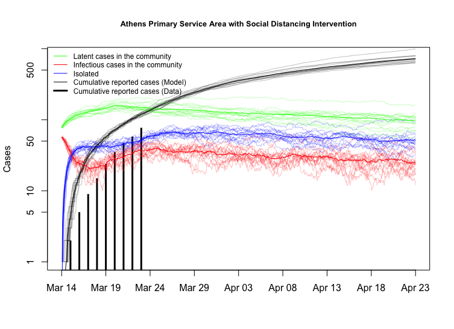
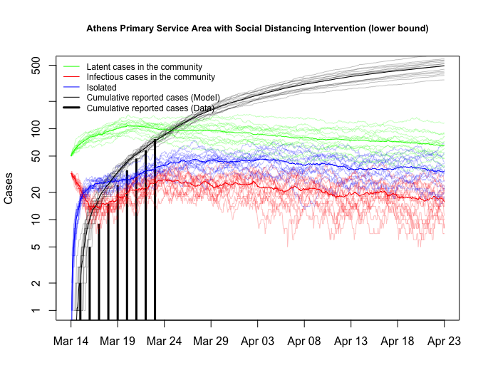
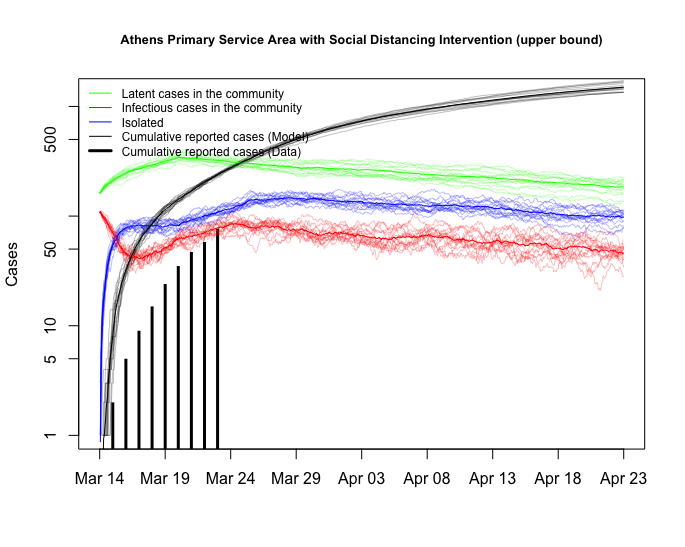

```{r setup, include=FALSE}
rm(list = ls())
library(ggplot2)
knitr::opts_chunk$set(echo = FALSE, cache=TRUE, warning=FALSE)
today <- Sys.Date()
 
acc_df <- read.csv("../Data/ACC Healthcare Region Simulation  - Case Counts by County GA.csv")
acc_df[is.na(acc_df)] <- 0
acc_df$primary <- acc_df$Clarke + acc_df$Oconee + acc_df$Barrow + acc_df$Madison
acc_df$primary_cum <- cumsum(acc_df$primary)

names(acc_df)[1] <- "Date"
acc_df$Date <- as.character(acc_df$Date)
acc_df$Date <- as.Date(stringr::str_replace_all(acc_df$Date, "-", "/"), 
                       format = "%m/%d/%Y")
# Currently cut off for 3/24
acc_df <- acc_df[1:which(acc_df$Date == as.Date("3/23/20", format = "%m/%d/%y")), ]

acc_df <- acc_df[, c("Date", "primary", "primary_cum")]
```


## Introduction

This document provides a very rough estimate of the COVID-19 outbreak in the Athens-Clarke county primary service area. Counties include Clarke, Barrow, Oconee, Jackson, Madison, and Oglethorpe.
To better understand the potential range of epidemic outcomes in the area, we used a model developed by the Center for the Ecology of Infectious Diseases at the University of Georgia based on data from Hubei Province, China calibrated to regionally specific conditions in Georgia. That Georgia-specific model was updated based on when the early cases in the ACC area began occurring.

More details about this model and its development can be found here:  
http://2019-coronavirus-tracker.com/stochastic-model.html

Calibration for Georgia can be found here:  
http://2019-coronavirus-tracker.com/stochastic-GA.html

## Data

At the time of this report, the ACC primary service area is reporting `r max(acc_df$primary_cum)` cases.

```{r}
ggplot(data = acc_df, mapping = aes(x = Date, y = primary)) +
  geom_bar(stat = "identity") +
  labs(x = "Day",
       y = "New Cases (Primary Service Area)") +
  theme_classic() +
  theme(axis.text.x = element_text(angle = 45, hjust = 1))

ggplot(data = acc_df, mapping = aes(x = Date, y = primary_cum)) +
  geom_bar(stat = "identity") +
  labs(x = "Day",
       y = "Cumulative Cases (Primary Service Area)") +
  theme_classic() +
  theme(axis.text.x = element_text(angle = 45, hjust = 1))
```


## Baseline Model with Intervention

The following plot visualizes the results of the based onthe flow of confirmed cases in the first 5 days of the start of the outbreak (3/14/2020) in the Athens-Clarke County primary service area. The key lines to focus on are the number of cumulative reported cases based on the model (set of black simulation lines that increase and flatten over time) and the cumulative reported cases based on the reported data (set of vertical black lines that include up to 3/23/2020). The other lines represent daily counts of exposed but not infectious cases in the community (latent, green lines), infectious cases in the community (red lines), and the identified and then isolated cases in the community (blue lines). The estimate of hospitalizations would be based on a subset of those isolated cases in the community.




## Upper and Lower Bounds

Upper and lower bounds were utilized based on assumptions about the intitial number of cases in the first week of the outbreak. These are shown below. Note the lower bound estimate currently tracks fairly closely with the number of reported cases.






